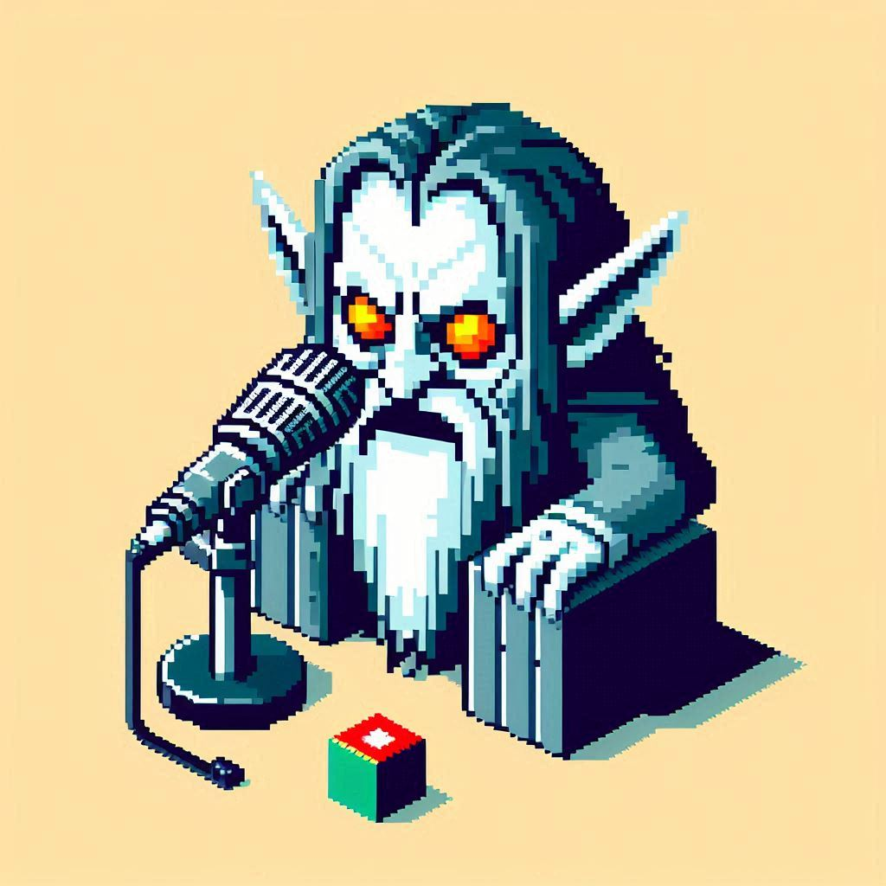

# Projeto Podcast Gerado por I.A.s

Projeto com o objetivo de gerar um podcast utilizando ferramentas de IA através de prompts mais trabalhado.

Utilizei uma esteira de prompts para gerar cada etapa do processo criativo.

## 💻 Tecnologias utilizadas no projeto

- [ChatGPT](https://chat.openai.com/) 
- [Copilot Designer](https://www.midjourney.com/app/)
- [Capcut](https://www.capcut.com/pt-br/)

## ✨ Como foi feito ?

- Roteiro gerado via ChatGPT
- Audio gerado pela ChatGPT (ElevenLabs não funcionou comigo)
- Copilot Designer para gerar capas (Midjourney é pago agora)
- Capcut para tratar aúdio e adicionar sons de fundo

## 📚 Materiais
[Prompts](https://github.com/DavidRBz/prompts-for-podcast-generate-by-ia/blob/main/Prompts.md)
[Podcast Editado](https://github.com/DavidRBz/prompts-for-podcast-generate-by-ia/blob/main/Podcast_Editado.mp3)

---

⌨️ com 💜 por [DavidRBz](https://github.com/DavidRBz)
